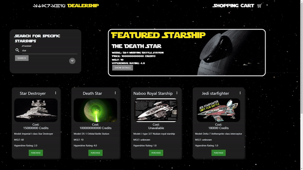
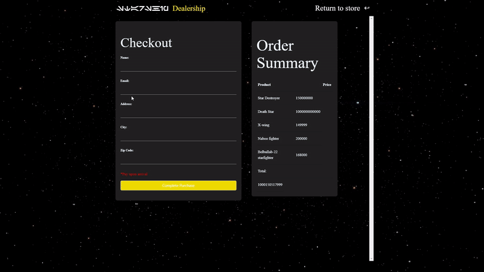

# StarWars Spaceship Dealership

## Description
 
This application represents the humor in the idea that in the Star Wars universe there exists Spaceship dealerships akin to car dealerships. We loved the idea of a Star Wars alien salesperson wearing a buttondown and tie trying to sell a customer a star destroyer. So we set out to create a hypothetical storefront for this dealership. This application takes 36 of the known *cannon* starships and with user input and engagement can display said 36 starships in a variety of manners through direct search or filtered search. The application even allows the user to try to checkout and purchase the starships they want.

To embody the spirit of Star Wars and set the idea that this is an in-unverse dealership we mimiced a clean space theme and even included the star wars in-universe written language Aurebesh

Overall when a user loads this application it should feel as though they are really in the Star Wars universe looking to buy a brand new Spaceship!

## Table of Contents (Optional)

If your README is long, add a table of contents to make it easy for customers to find what they need.

- [Usage](#usage)
- [Credits](#credits)
- [Features](#features)

## Usage 

Application link: https://samuelfullerca.github.io/StarWars-Spaceship-Dealership/

Interested in buying a starship? Well if the customer knows the name of the ship they want, or perhaps even a part of the name, simply type it in the "specific starships" search box. The box will present the customer with auto-fill options that will cater to what is being typed. If the customer selects one of the auto-fill options and clicks search then that exact ship will appear below. If the customer did not type the exact name the the engine will produce all available ships that match what the customer typed. For example, if the customer typed starfighter it will show all the starfighters.

  

But perhaps the customer doesn't quite know the names of ships, then they can click the filter option to open up a variety of filters that can be applied. Once the user clicks the filtered search button the engine will run all 36 starships through the filter and only show the ones that match the customers selected filters.

    

Regardless of how the customer wishes to search both methods will show cards of the ship, clicking the three vertical dots in the top-right corner of the card will display more details of said starship. Aditionally if the customer is interested in purchasing the starship they can click the purchase button to add it to their cart.

  

When ready to checkout the customer can view the cart in the top-right corner of their screen. The cart will display a dropdown menu with all the starships they have added and has to option to clear the cart or proceed to the checkout.

  

Once on the checkout page the customer is shown their cart and total and can input their information. Once the customer clicks complete purchase they are told which planet to go to to pick up their new spaceship(s)! 

  

## Credits

Application developers: Keanu Ford, Samuel Fuller, Wilie Yeh

Star wars details provided by Star Wars API:  https://swapi.tech/

Images provided by Google Images API:  https://developers.google.com/custom-search

Free use moving background provided by Pixabay: https://pixabay.com/

README gifs made with ezgif.com

## Features

This application's primary feature is its use of two APIs to generate the starship cards. Swapi (Star Wars API) provides all the details presented in the cards, and the Google Image API provides the image. Other features of note are the advanced filters, that actively alter search results based on the user's selections through a wide array of JavaScript code. Additionally, the ability to display the cart of items the user has added on two web pages in sync is an example of the use of local storage thought the application.
